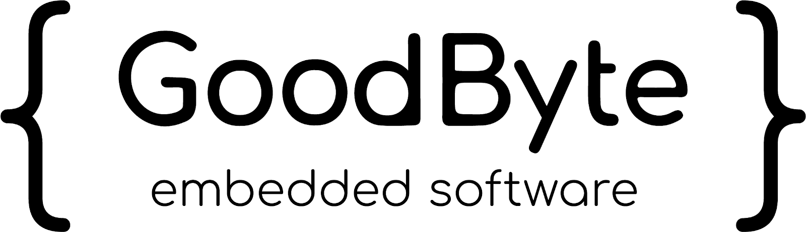

Goodbyte Templates for Embedded Development
===========================================

Available Templates
-------------------

- **Zephyr / Nordic**  
  Includes all utilities needed for development: ``west``, ``nrfutil``, ``jlink``, and more.
- **STM32**  
  Provides a basic setup ready to be extended and configured for your specific project needs.

Quick Start
-----------

Imagine you have a simple Zephyr project that only blinks an LED.  
Your project contains a single ``main.cpp`` file in ``app/src`` and a ``CMakeLists.txt`` one level above.

To set it up quickly in **VS Code**:

1. Press ``Ctrl + Shift + P``
2. Select **Dev Containers: Reopen in Container**
3. Choose **Add configuration to workspace**
4. Paste the following link when prompted and press **Enter**::

      ghcr.io/goodbyte-software/template-example/nordic:latest

5. Do not add any extra features – just confirm with **OK**

Your workspace should now be ready.

Learn More
----------

Read about our approach to devcontainers on our blog:  
👉 `Devcontainers – Our Embedded Workflow <https://goodbyte.software/devcontainers-our-embedded-workflow/>`_

Acknowledgements
----------------

This repository was generated using  
`devcontainers/template-starter <https://github.com/devcontainers/template-starter>`_.  
See their repository for more details on options and structure.
